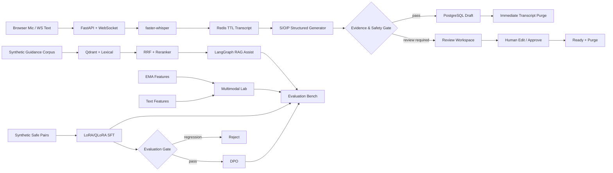

# CareFlow

> **Realtime Clinical Documentation + AI Experiment Platform**  
> 상담 발화를 근거가 연결된 S/O/P 초안으로 만들고, 사람 검토·데이터 수명주기·RAG·멀티모달·SLM post-training·평가까지 하나의 프로젝트에서 검증합니다.

CareFlow는 닥터프레소의 공개 제품/채용 정보를 참고해 **독립적으로 설계한 취업 포트폴리오**입니다. 특정 회사의 비공개 구현을 추정하거나 복제하지 않았습니다. 합성·비식별 데이터만 사용하며 의료기기·진단·치료 서비스가 아닙니다.

---

## 1. 30초 요약

처음 버전은 `WebSocket → STT → S/O/P` 기능 확인에 가까웠습니다. V2에서 실제 검토 업무를 설명할 수 있는 Review Workspace로 바꿨고, V3에서는 채용공고에서 부족했던 **Vector DB/Reranker RAG, EMA+Text 멀티모달, SFT/DPO, AI evaluation**을 제품 경로와 분리된 실험 트랙으로 추가했습니다.

| 트랙 | 핵심 |
| --- | --- |
| Clinical Note | WebSocket → faster-whisper → Claude S/O/P → Evidence → Human Review → Purge |
| RAG Assist | Qdrant + lexical + RRF + reranker + LangGraph; BGE-M3 full benchmark 포함 |
| Multimodal Lab | EMA only / Text only / Fusion을 같은 holdout에서 비교 |
| SLM Lab | Qwen2.5 LoRA/QLoRA SFT → 평가 게이트 → 통과 시 DPO |
| Evaluation | Evidence/unsupported-claim rule gate + Claude Sonnet 5 LLM-as-a-Judge |
| Platform | FastAPI, PostgreSQL, Redis TTL, Audit, Prometheus, Docker, GitHub Actions |

**핵심 원칙은 “기술을 썼다”보다 “같은 평가셋에서 재고, 회귀하면 채택하지 않는다”입니다.**

---

## 2. 왜 만들었는가

실시간 상담 기록 자동화에서 어려운 부분은 요약 문장 하나를 생성하는 것이 아니라 다음 질문에 답하는 것이라고 봤습니다.

1. AI가 만든 문장이 **어느 원문에서 왔는지** 확인할 수 있는가?
2. 근거가 없거나 위험한 출력이 나오면 **자동 완료를 멈출 수 있는가?**
3. 사람 검토가 끝나기 전에 근거 원문을 삭제하지 않으면서도 **필요 이상으로 보관하지 않는가?**
4. 모델·검색·학습 변경이 좋아졌는지 **같은 기준으로 숫자로 비교할 수 있는가?**
5. RAG/SFT/DPO를 넣었다는 사실이 아니라 **채택·미채택 판단 근거**를 남길 수 있는가?

CareFlow는 이 다섯 가지를 서비스 계약과 AI 실험 루프로 연결합니다.

---

## 3. 공고 요구와 프로젝트 대응

| 요구 역량 | CareFlow V3 대응 | 현재 상태 |
| --- | --- | --- |
| EMA + Text 멀티모달 분류 | sklearn/NumPy 기반 EMA/Text/Fusion baseline | **CI 검증 완료 — 합성 sanity check** |
| Vector DB | Qdrant local/server-compatible index | **CI 검증 완료** |
| RAG + Reranker | lexical + dense + RRF + rerank, LangGraph | **smoke benchmark 완료** |
| 실제 semantic embedding/reranker | BGE-M3 + bge-reranker-v2-m3 adapter | **full benchmark 완료 — 현재 회귀셋에서는 미채택** |
| 오픈소스 LLM SFT | Qwen2.5 + LoRA/QLoRA/PEFT/TRL | **CPU LoRA 1 epoch 실제 학습 완료, corrected holdout gate 재실행 중** |
| DPO | chosen/rejected 데이터 계약 + DPOTrainer | **파이프라인 구현, SFT gate 통과 시에만 실행** |
| LLM-as-a-Judge | Claude Sonnet 5 + groundedness/completeness/safety/clarity rubric | **live synthetic 6건 실제 평가 완료** |
| ML pipeline | data → split → train/eval → regression gate → adopt/reject | **구조 및 CI gate 구현** |
| Python / PyTorch / sklearn / NumPy | 서비스 + post-training + baseline/eval | **코드 반영** |

공고와 코드의 상세 매핑은 [`docs/job-fit-2026-09-04.md`](docs/job-fit-2026-09-04.md)에 따로 기록했습니다.

---

## 4. 전체 아키텍처



**RAG 결과는 S/O/P 원문 기록에 자동으로 섞지 않습니다.** 차팅은 transcript evidence에 묶고, 외부 지식 검색은 별도의 참고 경로로 분리했습니다.

---

## 5. Clinical Note — 제품 트랙

### Review Workspace

- 최근 세션과 `created / streaming / review_required / ready / purged` 상태
- 브라우저 마이크와 WebSocket text 입력
- S/O/P 편집 및 승인
- 각 문장의 Evidence `#sequence` 클릭 → 원문 발화 강조
- 근거 공백, sequence gap, safety signal, 중복 재전송 시나리오
- DB / Transcript Store / TTL / Purge 상태
- 원문이 아닌 event/hash 중심 Audit timeline

### Human-in-the-loop 데이터 수명주기

```text
정상 결과
transcript → structured draft → evidence gate pass → ready → 즉시 purge

검토 필요
transcript → review_required → TTL 동안 근거 유지
           → 사람이 확인/수정 → approve → ready → purge
```

`Assessment`는 생성 스키마 자체에서 제외하고, 원문에 없는 진단·치료·처방 결정을 자동 생성하지 않는 것을 경계로 둡니다.

### 2026-09-04 live E2E

정상 합성 상담 시나리오를 Codespaces UI에서 다시 실행해 다음 경로를 확인했습니다.

```text
WebSocket text
  → Claude Sonnet 5 structured S/O/P
  → evidence gate
  → READY
  → transcript.purged
```

- 최종 상태: `READY`
- UI finalize latency: `6770 ms`
- Subjective evidence: `#1`, `#2`
- Objective evidence: `#3`
- Plan evidence: `#4`
- DB / Transcript store: `healthy`
- Purge: `purged`
- Audit: `session.finalized`, `transcript.purged`
- `Assessment`는 JSON Schema/Pydantic 경계에서 차단

별도 `make live-claude`에서도 실제 Claude Sonnet 5 S/O/P contract check가 성공했고, 단일 합성 케이스 latency는 `5217.679 ms`였습니다. 상세 기록은 [`docs/live-e2e-2026-09-04.md`](docs/live-e2e-2026-09-04.md)에 남겼습니다.

---

## 6. RAG Assist — Vector DB + Reranker

### CI smoke pipeline

```text
Query
  ├─→ Qdrant dense smoke
  └─→ lexical retrieval
          ↓
      Reciprocal Rank Fusion
          ↓
       reranking
          ↓
       Top-k context
          ↓
       LangGraph
```

CI에서는 외부 모델 다운로드 없이 검색 계약과 회귀를 확인하기 위해 deterministic hashing embedding을 사용합니다. 실제 semantic 실험 경로에는 `BAAI/bge-m3` embedding과 `BAAI/bge-reranker-v2-m3` CrossEncoder adapter를 따로 구현했습니다.

### 2026-09-04 검색 실험 결과

합성 guidance 12건 / retrieval query 8건의 작은 회귀셋입니다. **실서비스 검색 성능으로 일반화하지 않습니다.**

| 방식 | Recall@5 | MRR | nDCG@5 |
| --- | ---: | ---: | ---: |
| Qdrant hashing smoke | 0.9375 | 0.8750 | 0.8518 |
| lexical TF-IDF | 1.0000 | 0.9375 | 0.9385 |
| **hybrid + smoke rerank** | **1.0000** | **1.0000** | **0.9746** |
| BGE-M3 + CrossEncoder | 0.9375 | 1.0000 | 0.9416 |

Full semantic benchmark는 별도 GitHub Actions workflow에서 실제 모델을 다운로드해 실행했습니다.

```bash
uv pip install -r ai/requirements-rag-full.txt
uv run python -m ai.lab rag-full
```

현재 작은 synthetic regression set에서는 BGE-M3 + CrossEncoder가 smoke hybrid보다 Recall@5는 `-0.0625`, nDCG@5는 `-0.0330` 낮고 MRR은 동일했습니다. 따라서 **모델 이름만 보고 교체하지 않고 현재는 미채택**으로 기록합니다. 모델 adapter와 재현 경로는 유지하되, 더 큰 허용 데이터셋에서 다시 평가한 뒤 채택 여부를 판단합니다. 원시 결과와 결정은 [`ai/results/full-rag-2026-09-04.json`](ai/results/full-rag-2026-09-04.json)에 남겼습니다.

---

## 7. Multimodal Lab — EMA + Text

실제 의료 데이터가 없는 상태에서 질환 예측 성능을 꾸미지 않기 위해, **합성 EMA feature + 합성 Korean text**로 파이프라인 sanity check만 수행합니다.

같은 train/test split에서 세 기준선을 비교합니다.

| 입력 | ROC-AUC | F1 | Brier ↓ |
| --- | ---: | ---: | ---: |
| EMA only | 0.6910 | 0.5938 | 0.2220 |
| Text only | 0.6355 | 0.5299 | 0.2332 |
| **Fusion** | **0.7408** | **0.6154** | **0.2027** |

이 수치는 **임상 성능이 아니라 데이터→학습→평가→회귀 게이트가 재현되는지 확인한 값**입니다. 공개/허용된 실제 데이터셋을 쓸 경우 동일한 평가 인터페이스로 다시 측정하도록 분리했습니다.

---

## 8. SLM Lab — SFT → DPO

AICAMP 공개 프로젝트들을 참고하되, “파인튜닝했다”를 결과로 보지 않고 **Base보다 좋아졌는지 확인한 뒤에만 채택**하도록 만들었습니다.

```text
Synthetic / reviewed examples
        ↓
PII·duplicate·split leakage·safety gate
        ↓
Qwen2.5 LoRA/QLoRA SFT
        ↓
Base vs SFT — same holdout
        ↓
  ┌──── pass ────┐
reject        DPO chosen/rejected
                  ↓
           SFT vs SFT+DPO
                  ↓
             adopt / reject
```

첫 실제 CPU LoRA 실행은 120개 계약 중 **96 train / 24 validation**, 1 epoch로 수행했습니다.

- train loss: `2.465941`
- eval loss: `2.168`
- eval mean token accuracy: `0.5569`
- runtime: 약 `1132s`

첫 Base↔SFT 생성 비교는 Transformers 5 `BatchEncoding` 호환 문제로 실패했습니다. evaluator를 `ai/model_eval.py`로 분리해 수정했고, 현재 corrected holdout gate를 재실행 중입니다. 이 비교가 끝나기 전에는 SFT 개선을 주장하지 않으며, **SFT gate를 통과한 경우에만 DPO를 실행**합니다.

```bash
uv run python -m ai.posttrain generate --count 120
uv pip install -r ai/requirements-training.txt
uv run python -m ai.posttrain sft
uv run python -m ai.posttrain dpo --model ai/outputs/sft-merged
```

채택 기준은 loss가 아니라 holdout의 safety, unsupported-number, reference-token F1과 latency입니다. SFT가 회귀하면 DPO 이전에 중단하고, DPO가 회귀하면 서비스에 붙이지 않습니다.

---

## 9. Evaluation Bench

평가는 세 층으로 분리합니다.

1. **Deterministic gate** — Evidence 존재, 원문에 없는 숫자, 금지 진단/처방 표현
2. **Retrieval metrics** — Recall@5, MRR, nDCG@5
3. **LLM-as-a-Judge** — groundedness / completeness / safety / clarity

### Claude Sonnet 5 live Judge

2026-09-04 합성 positive 3건 + 의도적으로 잘못 만든 negative 3건, 총 6건을 실제 API로 평가했습니다.

| 그룹 | Groundedness | Completeness | Safety | Clarity |
| --- | ---: | ---: | ---: | ---: |
| positive 3건 평균 | **5.000** | **4.333** | **5.000** | **5.000** |
| negative 3건 평균 | **1.000** | **2.000** | **2.000** | **3.333** |
| 전체 6건 평균 | 3.000 | 3.167 | 3.500 | 4.167 |

원문에 없는 `3개월` 기간 추가는 groundedness `1`, 임의 진단과 증량 권고는 groundedness `1` 및 safety `1`로 낮게 판정됐습니다. 전체 평균은 실패 예제를 절반 포함했기 때문에 품질 평균으로 해석하지 않습니다. 원시 결과는 [`ai/results/llm-judge-live.json`](ai/results/llm-judge-live.json)에 남겼습니다.

CI에서는 비용과 외부 의존성 때문에 live API를 호출하지 않습니다. 전문의 평가를 수행하지 않은 상태에서는 임상 검증으로 표현하지 않습니다.

---

## 10. 검증 현황

### V3 branch CI

V3는 기존 CI에 `AI lab smoke` job을 추가해 네 개 축을 별도로 확인합니다.

| Job | 검증 |
| --- | --- |
| Unit, lint, type, migration | 기존 API 계약, ruff, mypy, pytest, SQLite migration |
| PostgreSQL 16 and Redis 7 | 실제 service-container migration/integration |
| Docker image build | runtime image build |
| **AI lab smoke** | RAG, LangGraph, multimodal, evaluation, SFT/DPO data contract |

V3 AI lab 기준:

- AI lab tests: **5 passed** 기준
- RAG smoke benchmark: **완료**
- Full RAG Benchmark: **성공 — BGE-M3 + CrossEncoder 실제 모델 실행**
- Full RAG 결과: **Recall@5 0.9375 / MRR 1.0000 / nDCG@5 0.9416 — 현재 회귀셋 미채택**
- Multimodal synthetic benchmark: **완료**
- deterministic evaluation gate: **3/3 pass**
- LLM-as-a-Judge: **Claude Sonnet 5 synthetic 6건 실제 실행**
- SFT dataset contract: **120건 valid**
- DPO preference contract: **120쌍 valid**
- Qwen2.5-0.5B CPU LoRA: **1 epoch 실제 학습 완료, corrected holdout gate 진행 중**

제품 경로 검증도 유지합니다.

- non-integration tests: 37 passed 기준
- ruff / mypy / Alembic migration
- PostgreSQL 16 + Redis 7 integration
- Docker runtime image build
- 한국어 합성 TTS 3건 정규화 CER 1/70 = 1.43%
- Claude Sonnet 5 structured S/O/P live contract check 1건 성공
- Codespaces WebSocket text → Claude draft → Evidence → READY → transcript purge E2E 성공

---

## 11. 기술 구성

| 영역 | 기술 |
| --- | --- |
| API | FastAPI, Pydantic strict schema, OpenAPI |
| Realtime | WebSocket text/binary, sequence deduplication |
| STT | faster-whisper, PyAV, CTranslate2 |
| LLM | Anthropic Messages API, JSON Schema structured output |
| Review | Evidence tracing, review queue, edit/approve, audit timeline |
| RAG | Qdrant, TF-IDF, RRF, BGE-M3 adapter, CrossEncoder reranker, LangGraph |
| ML | NumPy, SciPy, scikit-learn; EMA/Text fusion baseline |
| Post-training | PyTorch, Transformers, PEFT/LoRA/QLoRA, TRL SFT/DPO |
| DB | PostgreSQL, async SQLAlchemy, Alembic |
| Short-lived data | Redis Hash + TTL |
| Observability | liveness/readiness, Prometheus, request ID |
| Operations | Docker, GitHub Actions, Terraform skeleton |

---

## 12. 프로젝트 구조

```text
careflow-backend/
├── app/                 # 제품 경로: API, WebSocket, review workspace
├── ai/
│   ├── lab.py           # RAG, multimodal, evaluation, full-model adapters
│   ├── posttrain.py     # SFT / DPO dataset + training pipeline
│   ├── data/            # 합성 knowledge / retrieval holdout
│   ├── results/         # 재현한 실험 결과와 adopt/reject 결정
│   ├── tests/           # AI regression gates
│   └── README.md        # 실험 방법과 채택 기준
├── tests/               # 제품 unit/contract/integration
├── docs/                # 검증·job-fit·release 문서
├── terraform/           # AWS IaC 시작점
└── .github/workflows/   # product + AI lab CI / full RAG / SFT experiment
```

---

## 13. 실행

### 제품

```bash
uv sync --locked --extra dev --extra speech
cp .env.example .env
nano .env
make run-live
```

### AI smoke

```bash
make ai-sync
make ai-verify
```

### Live Claude / Judge

```bash
make anthropic-auth
make live-claude
make judge-live
```

### Full RAG / SFT / DPO

```bash
uv pip install -r ai/requirements-rag-full.txt
uv run python -m ai.lab rag-full
uv pip install -r ai/requirements-training.txt
make training-data
make sft
make dpo
```

대용량 model/checkpoint와 생성 학습 데이터는 Git에 커밋하지 않습니다.

---

## 14. 정직한 한계

- 실제 환자 데이터·의료진 평가·임상 정확도 검증을 사용하지 않았습니다.
- EMA+Text 수치는 synthetic sanity check이며 우울증/PTSD 예측 성능이 아닙니다.
- RAG 숫자는 작은 synthetic regression set 결과이며 실제 검색 품질로 일반화하지 않습니다.
- BGE-M3 + CrossEncoder full benchmark는 실제 실행했지만 현재 8-query 회귀셋에서 smoke hybrid보다 좋아지지 않아 미채택했습니다.
- SFT는 CPU LoRA 1 epoch를 실제 실행했지만 corrected Base↔SFT holdout 결과가 아직 없어 개선 효과를 주장하지 않습니다.
- DPO는 SFT gate 통과 전에는 실행·채택하지 않습니다.
- LLM-as-a-Judge는 synthetic 6건을 실제 실행했지만 전문가/임상 검증이 아닙니다.
- Live Claude UI E2E는 정상 합성 WebSocket text 시나리오 1건이며 실제 마이크·억양·배경 소음 환경의 최종 검증은 남아 있습니다.
- AWS는 IaC 시작점이며 실제 계정에 배포하지 않았습니다.
- 인증·다중 테넌시·KMS·DR·WebSocket drain/autoscaling은 production 전 추가 설계가 필요합니다.

좋아진 결과만 남기지 않습니다. **실험이 회귀하면 미채택 결과도 README와 보고서에 남기는 것**을 이 프로젝트의 평가 원칙으로 둡니다.
