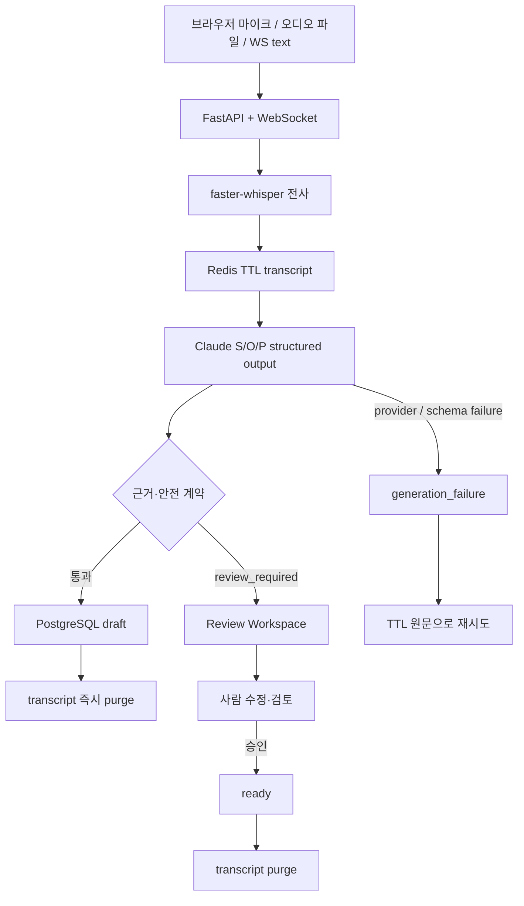

# CareFlow Backend

실시간 상담 발화를 **WebSocket → faster-whisper → Claude → 근거가 연결된 S/O/P 초안 → 사람 검토 → 원문 삭제**로 연결한 백엔드 포트폴리오 프로젝트입니다.

단순 음성 요약 데모가 아니라, AI 출력의 근거·검토 상태·재시도·데이터 수명주기·운영 상태를 하나의 서비스 계약으로 다루는 것을 목표로 했습니다. 임상 판단인 `Assessment`는 JSON Schema와 Pydantic 수준에서 허용하지 않습니다.

> 닥터프레소의 공개 제품 설명을 읽고 독립적으로 설계한 취업 포트폴리오입니다. 특정 기업의 비공개 구현을 추정하거나 복제하지 않았습니다. 합성·비식별 데이터만 사용하며 의료기기·진단·치료 서비스가 아닙니다.

## CareFlow V2

V2에서는 기존의 기능 확인용 화면을 **실제 검토 업무를 설명할 수 있는 Review Workspace**로 바꿨습니다.

- 최근 세션 목록과 `created / streaming / review_required / ready / purged` 상태를 한 화면에서 확인
- 정상·근거 공백·sequence gap·safety signal·중복 재전송 시나리오 재현
- WebSocket text, 브라우저 마이크, 오디오 파일 업로드를 같은 세션 상태 머신으로 처리
- S/O/P의 `evidence sequence`를 누르면 해당 transcript 발화를 강조
- `review_required` 초안을 직접 수정하고 저장하거나 승인 가능
- 검토가 필요한 전사 원문은 Redis TTL 동안만 유지하고 **사람 승인 시 삭제**
- 검토가 필요 없는 정상 초안은 finalize 직후 전사 원문 삭제
- Audit timeline에는 원문 대신 이벤트와 해시만 기록
- DB·Transcript Store 상태, TTL, review queue와 브라우저 기준 finalize 왕복 시간을 UI에서 확인

## 지금 실제로 되는 것

| 영역 | 구현 상태 | 검증 경계 |
| --- | --- | --- |
| 실시간 세션 | REST + WebSocket text/binary, sequence dedup, Idempotency-Key | 텍스트 전체 경로 실검증; 실제 장시간 연결·수평 확장은 미검증 |
| 음성 인식 | 브라우저 MediaRecorder / 오디오 파일 → `faster-whisper` | 한국어 합성 TTS 3건에서 정규화 CER 1/70(1.43%); 실제 마이크·소음 환경은 별도 검증 필요 |
| AI 초안 | Anthropic native Messages API + JSON Schema + Pydantic | 합성 대화 1건 실제 Claude 구조·근거 계약 확인; 임상 품질 일반화는 아님 |
| Evidence | S/O/P별 source sequence 저장 + UI 클릭 추적 | 존재하지 않는 근거·근거 공백은 자동 완료하지 않고 검토 전환 |
| Human review | 초안 수정 저장 / 승인, review queue | 승인 시 review reason 제거, `ready` 전환, TTL 원문 삭제 계약 테스트 |
| 데이터 수명주기 | 음성 비저장, 전사 Redis TTL, 파생 초안 PostgreSQL | 정상 완료는 즉시 purge; 검토 필요는 TTL 내 보존 후 승인 시 purge |
| 영속화 | PostgreSQL + async SQLAlchemy + Alembic, Redis Hash+TTL | GitHub Actions에서 PostgreSQL 16 migration + Redis 7 실제 서비스 계약 통과 |
| 운영·관측성 | liveness/readiness, Prometheus, request ID, audit timeline, operations snapshot | 운영 트래픽·장애 복구·장기 부하는 미검증 |
| CI·컨테이너 | lint, mypy, pytest, SQLite migration, Postgres/Redis integration, Docker build | CareFlow V2 PR CI #9의 3개 job 모두 성공 |
| AWS | ECS·ALB·RDS·ElastiCache Terraform 시작점 | 실제 AWS 계정에는 배포하지 않음 |

## 데이터 수명주기



핵심 의도는 **검토할 근거를 먼저 삭제하지 않는 것**입니다. 정상 초안은 원문을 즉시 삭제하지만, `review_required`는 configured TTL 동안만 transcript를 남겨 사람이 evidence와 원문을 대조할 수 있게 하고 승인 시 삭제합니다.

## Review Workspace에서 보여주는 것

### 1. Session dashboard

최근 세션을 상태별로 필터링할 수 있습니다.

```text
created → streaming → processing → ready
                              ↘ review_required → ready
                                              ↘ purged
```

### 2. Evidence tracing

Claude가 생성한 각 section에는 transcript sequence가 연결됩니다.

```json
{
  "section": "subjective",
  "source_sequences": [1, 2]
}
```

UI에서 `#1`, `#2`를 누르면 원문 발화를 바로 강조합니다. TTL 만료나 purge 이후에는 해당 원문이 더 이상 존재하지 않는다는 상태도 명시합니다.

### 3. Human-in-the-loop review

`review_required`에서는 자동 완료하지 않습니다.

- 초안 문구 수정 후 저장
- review reason과 evidence 확인
- 승인 후 `ready` 전환
- 승인과 함께 transcript purge
- 수정·승인·삭제 이벤트를 audit timeline에 기록

### 4. Failure / safety scenarios

화면에서 다음 synthetic scenario를 바로 재현할 수 있습니다.

| 시나리오 | 확인할 것 |
| --- | --- |
| 정상 상담 | S/O/P + evidence 생성 → `ready` → transcript purge |
| 근거 공백 | `evidence_gap` → `review_required` |
| Sequence gap | 누락 sequence 감지 → `review_required` |
| Safety signal | 위험 신호를 자동 판단으로 끝내지 않고 사람 검토로 전환 |
| 중복 재전송 | 동일 sequence를 중복 저장하지 않는 idempotent 처리 |

## API

주요 REST 경로:

```text
GET    /v1/capabilities
GET    /v1/operations
POST   /v1/sessions
GET    /v1/sessions
GET    /v1/sessions/{session_id}
GET    /v1/sessions/{session_id}/transcript
POST   /v1/sessions/{session_id}/chunks
POST   /v1/sessions/{session_id}/finalize
GET    /v1/sessions/{session_id}/draft
PATCH  /v1/sessions/{session_id}/draft
GET    /v1/sessions/{session_id}/audit
DELETE /v1/sessions/{session_id}
```

WebSocket:

```text
/v1/ws/sessions/{session_id}
```

텍스트와 오디오가 동일한 `SessionService`와 sequence 규칙을 사용합니다.

## 설계에서 확인할 부분

- REST와 WebSocket이 하나의 세션 상태 머신을 공유합니다.
- `sequence`로 발화 재전송을, `Idempotency-Key`로 세션 중복 생성을 방지합니다.
- Claude 요청은 Anthropic `/v1/messages`를 직접 사용합니다.
- `output_config.format` JSON Schema와 Pydantic `extra=forbid`를 이중 적용합니다.
- transcript 내부 지시는 비신뢰 입력으로 취급합니다.
- `Assessment` 필드는 생성 스키마 자체에 존재하지 않습니다.
- S/O/P의 모든 근거 sequence를 검사하고 근거가 없거나 잘못되면 검토 상태로 전환합니다.
- Claude provider·schema 실패는 실패 초안을 남기고 TTL 내 재시도를 허용합니다.
- 원본 음성은 메모리와 자동 삭제 임시 파일에서만 처리하고 DB·Redis에 저장하지 않습니다.
- Audit에는 발화 내용이 아니라 SHA-256 hash와 event type만 남깁니다.
- Redis와 PostgreSQL을 하나의 원자 트랜잭션으로 묶었다고 주장하지 않으며, 운영에서는 outbox/보상·lease/recovery가 추가로 필요합니다.

## 기술 구성

| 영역 | 구현 |
| --- | --- |
| API | FastAPI, Pydantic strict schema, OpenAPI |
| Realtime | WebSocket text/binary, REST fallback, sequence deduplication |
| STT | faster-whisper 1.2.1, PyAV, CTranslate2, VAD, CPU int8 기본값 |
| LLM | Claude Sonnet 5, Anthropic Messages API, JSON Schema structured output |
| Review | Evidence tracing, review queue, draft edit/approve, audit timeline |
| DB | PostgreSQL, async SQLAlchemy, Alembic; SQLite test adapter |
| Short-lived data | Redis Hash + TTL; fakeredis contract test |
| Observability | liveness/readiness, Prometheus metrics, request ID, operations API |
| Operations | Docker Compose, GitHub Actions, Terraform skeleton |

## 실행

Python 3.11 이상이 필요합니다.

```bash
uv sync --locked --extra dev --extra speech
cp .env.example .env
nano .env
```

`.env`에는 개인 키를 로컬에서만 설정합니다.

```dotenv
NOTE_GENERATOR_MODE=anthropic
ANTHROPIC_API_KEY=
ANTHROPIC_MODEL=claude-sonnet-5
SPEECH_RECOGNITION_MODE=faster_whisper
WHISPER_MODEL=small
WHISPER_DEVICE=cpu
WHISPER_COMPUTE_TYPE=int8
```

실행:

```bash
make run-live
```

브라우저에서 `http://localhost:8000`을 엽니다. 첫 Whisper 실행은 `small` 모델 다운로드와 로딩 때문에 오래 걸릴 수 있습니다.

Claude 비용 없이 회귀 테스트용 기준선만 실행하려면 `NOTE_GENERATOR_MODE=deterministic`을 사용합니다. 이 모드는 실제 LLM 문맥 요약을 대신하지 않습니다.

## Codespaces에서 V2 확인

```bash
git fetch origin
git switch careflow-v2
git pull --ff-only origin careflow-v2
uv sync --locked --extra dev --extra speech
make run-live
```

Ports 탭의 `8000`을 브라우저에서 열고 포트 공개 범위는 Private로 유지합니다.

권장 데모 순서:

1. `정상 상담` → `시나리오 실행`
2. `Claude 초안 생성`
3. S/O/P evidence `#번호`를 눌러 transcript highlight 확인
4. `Safety signal` 시나리오를 새로 실행
5. `review_required`와 transcript TTL 유지 확인
6. 초안을 수정하고 `수정 저장`
7. `승인하고 원문 삭제`
8. 상태가 `ready`, purge가 완료되고 audit event가 남는지 확인

## WebSocket 오디오 계약

먼저 메타데이터를 보냅니다.

```json
{"type":"audio.start","sequence":1,"speaker":"patient","content_type":"audio/webm"}
```

`audio.ready` 뒤 완성된 WebM/MP4/Ogg/WAV/MP3 binary frame을 전송합니다.

성공 응답 예시:

```json
{
  "type": "transcript.recognized",
  "sequence": 1,
  "speaker": "patient",
  "text": "최근 잠들기 어려웠습니다.",
  "duplicate": false,
  "language": "ko",
  "duration_seconds": 2.4,
  "recognizer_version": "faster-whisper-small-v1",
  "raw_audio_persisted": false
}
```

## 검증

```bash
uv run ruff check .
uv run mypy app
uv run pytest -m "not integration"
DATABASE_URL=sqlite+aiosqlite:///./release-check.db uv run alembic upgrade head
```

2026-09-04 CareFlow V2 PR 기준:

| 검증 | 결과 |
| --- | --- |
| pytest non-integration | 37 passed |
| ruff | all checks passed |
| mypy | 15개 source files, 오류 0 |
| SQLite migration | 성공 |
| PostgreSQL 16 + Redis 7 | 실제 service-container integration 성공 |
| Docker image | runtime image build 성공 |
| GitHub Actions | V2 PR CI #9의 3개 job 모두 성공 |
| 한국어 STT 소표본 | 합성 TTS 3건, 정규화 CER 1/70 = 1.43% |
| Claude 실호출 | 합성 대화 1건의 S/O/P + evidence contract 확인 |
| 텍스트 E2E | Codespaces WebSocket text → Claude → draft → purge 확인 |
| 인프로세스 회귀 벤치마크 | 기존 기준 300세션·1,500요청·실패 0; finalize p95 6.029ms |

인프로세스 벤치마크는 PostgreSQL·Redis·네트워크·Whisper·Claude·AWS 처리량을 의미하지 않습니다.

## 정직한 한계

- 실제 환자 데이터, 의료진 평가, 임상 정확도 검증을 사용하지 않았습니다.
- 한국어 CER 1.43%는 깨끗한 합성 TTS 3건의 소표본입니다.
- 실제 마이크·억양·배경 소음·겹침 발화 STT 평가는 아직 하지 않았습니다.
- Claude 실호출은 합성 대화의 구조·근거 계약 확인이며, 다양한 상담 문맥의 품질·지연·비용 평가는 별도 과제입니다.
- 발화 단위 준실시간 처리이며 연속 부분 자막 streaming ASR은 구현하지 않았습니다.
- 인증·권한·다중 테넌시·KMS·비밀 회전·운영 DR은 포트폴리오 범위 밖입니다.
- Redis/PostgreSQL 분산 상태에 대한 outbox, worker lease/recovery, WebSocket drain·autoscaling은 운영 전 추가 설계가 필요합니다.
- AWS 폴더는 IaC 시작점이며 실제 계정에 plan/apply하지 않았습니다.
- 실제 의료정보를 외부 Claude API로 처리하려면 별도 계약·동의·보안·규제 검토가 필요합니다.

공개 전에는 [`docs/github-release-checklist.md`](docs/github-release-checklist.md)를 기준으로 비밀·개인 데이터·라이선스·재현성을 다시 확인합니다.
