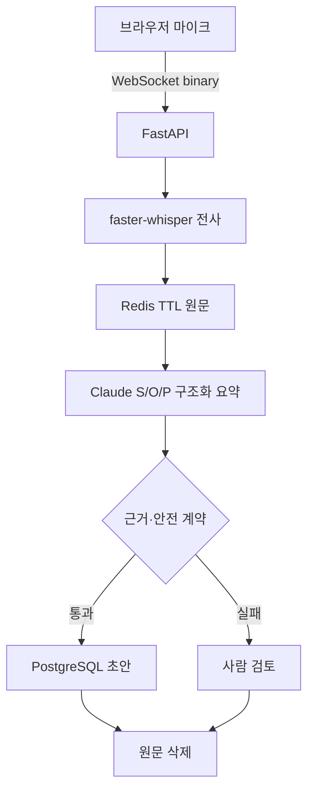

# CareFlow Backend

마이크로 받은 상담 발화를 로컬 Whisper로 전사하고, Claude가 대화의 맥락을 이해해 **근거가 연결된 S/O/P 초안**을 만드는 백엔드 포트폴리오 프로젝트입니다. 임상 판단인 `Assessment`는 스키마 수준에서 허용하지 않으며, 근거 공백·위험 신호·생성 실패는 자동 결론 대신 `review_required`로 전환합니다.

> 닥터프레소 채용 공고를 분석해 독립적으로 설계한 취업 포트폴리오입니다. 특정 기업의 비공개 제품을 복제한 것이 아니며, 합성 데이터만 사용합니다. 의료기기·진단·치료 서비스가 아닙니다.

## 지금 실제로 되는 것

| 영역 | 구현 상태 | 검증 경계 |
| --- | --- | --- |
| 대화 이해·요약 | Anthropic 네이티브 Messages API와 JSON Schema 구조화 출력 | 모의 API 계약 테스트 완료; 실제 호출은 개인 API 키 설정 후 가능 |
| 음성 인식 | 브라우저 MediaRecorder → WebSocket binary → 로컬 `faster-whisper` | 패키지 로드와 영어 합성 음성 실제 추론 완료; 한국어 마이크 정확도 평가는 별도 필요 |
| 실시간 수신 | 텍스트와 발화 단위 음성을 동일 WebSocket 세션으로 수신 | 순번 중복·크기·길이·상태 오류 테스트 완료 |
| 데이터 수명주기 | 원문 텍스트 Redis TTL, 음성 비저장, 성공 후 원문 삭제 | 인메모리·fakeredis 계약 테스트 완료 |
| 영속화 | PostgreSQL + async SQLAlchemy + Alembic | 로컬 테스트는 SQLite 어댑터 사용 |
| AWS | ECS·ALB·RDS·ElastiCache Terraform 시작점 | 실제 계정에는 배포하지 않음 |

규칙 기반 생성기는 AI 기능을 대신하지 않습니다. 테스트 재현성과 장애 격리를 위한 `deterministic` 기준선으로만 남겨 두었고, 완전한 데모는 `NOTE_GENERATOR_MODE=anthropic`으로 실행합니다.

## 요청 흐름



브라우저는 녹음이 끝난 한 발화를 보내며, 서버는 전사가 끝나는 즉시 텍스트를 돌려줍니다. 연속 음성의 부분 자막을 생성하는 스트리밍 ASR이라고 주장하지 않고, **발화 단위 준실시간 방식**으로 범위를 명시했습니다.

## 설계에서 확인할 부분

- REST와 WebSocket이 하나의 세션 상태 머신을 공유합니다.
- `sequence`로 발화 재전송을, `Idempotency-Key`로 세션 중복 생성을 방지합니다.
- Claude 요청은 범용 호환 API가 아니라 Anthropic `/v1/messages`를 사용합니다.
- `output_config.format`의 JSON Schema와 Pydantic 검증을 이중 적용합니다.
- transcript 내부의 프롬프트 주입 지시는 비신뢰 입력으로 취급합니다.
- S/O/P 각각에 근거 발화 순번을 붙이고, 존재하지 않는 순번은 사람 검토로 보냅니다.
- Claude 거절·토큰 초과·HTTP 오류·스키마 위반 시 실패 초안을 저장하고 TTL 내 재시도를 허용합니다.
- 원본 음성은 메모리와 자동 삭제 임시 파일에서만 처리하고 DB·Redis에 저장하지 않습니다.
- 감사 로그에는 발화 대신 SHA-256 해시와 이벤트 유형만 남깁니다.

## 기술 구성

| 영역 | 구현 |
| --- | --- |
| API | FastAPI, Pydantic strict schema, OpenAPI |
| 실시간 | WebSocket text/binary, REST fallback, sequence deduplication |
| STT | `faster-whisper` 1.2.1, PyAV, CTranslate2, VAD, CPU int8 기본값 |
| LLM | Claude Sonnet 5, Anthropic Messages API, JSON Schema structured output |
| DB | PostgreSQL, SQLAlchemy async, Alembic; SQLite test adapter |
| 단기 저장 | Redis Hash + TTL; fakeredis contract test |
| 관측성 | liveness/readiness, Prometheus metrics, request ID |
| 운영 | Docker Compose, GitHub Actions, Terraform skeleton |

Claude 요청 형식은 [Anthropic Structured outputs 문서](https://platform.claude.com/docs/en/build-with-claude/structured-outputs)를, 음성 변환 방식은 [SYSTRAN faster-whisper](https://github.com/SYSTRAN/faster-whisper)를 기준으로 구현했습니다.

## 완전한 로컬 데모

Python 3.11 이상이 필요합니다.

```bash
uv sync --extra dev --extra speech
cp .env.example .env
```

`.env`의 `ANTHROPIC_API_KEY`에 본인의 키를 로컬에서만 설정합니다. 키를 코드·스크린샷·GitHub에 넣지 않습니다. 기본 전체 데모 설정은 다음과 같습니다.

```dotenv
NOTE_GENERATOR_MODE=anthropic
ANTHROPIC_API_KEY=
ANTHROPIC_MODEL=claude-sonnet-5
SPEECH_RECOGNITION_MODE=faster_whisper
WHISPER_MODEL=small
WHISPER_DEVICE=cpu
WHISPER_COMPUTE_TYPE=int8
```

실행:

```bash
uv run uvicorn app.main:app --reload --port 8000
```

브라우저에서 `http://localhost:8000`을 엽니다. 마이크 권한은 localhost 또는 HTTPS에서만 허용됩니다. 첫 음성 인식 때 Whisper 모델을 내려받으므로 최초 1회가 오래 걸릴 수 있습니다.

Claude 비용 없이 백엔드 회귀만 재현하려면 `NOTE_GENERATOR_MODE=deterministic`으로 바꿉니다. 이는 실제 문맥 요약 데모가 아니라 기준선입니다.

PostgreSQL·Redis까지 포함하려면 `.env` 설정 후 다음을 실행합니다.

```bash
docker compose up --build
```

## 실호출 점검

Claude 구조화 요약 한 건:

```bash
uv run python scripts/live_claude_check.py
```

로컬 음성 파일 한 건:

```bash
uv run python scripts/transcribe_audio.py sample.wav
```

두 명령 모두 합성·비식별 데이터만 사용해야 합니다.

## WebSocket 오디오 계약

연결: `ws://localhost:8000/v1/ws/sessions/{session_id}`

먼저 오디오 메타데이터를 전송합니다.

```json
{"type":"audio.start","sequence":1,"speaker":"patient","content_type":"audio/webm"}
```

`audio.ready` 응답 뒤 완성된 WebM/MP4/Ogg/WAV/MP3 파일을 binary frame으로 전송합니다. 성공 응답 예시는 다음과 같습니다.

```json
{
  "type": "transcript.recognized",
  "sequence": 1,
  "speaker": "patient",
  "text": "최근 잠들기 어려웠습니다.",
  "duplicate": false,
  "language": "ko",
  "duration_seconds": 2.4,
  "recognizer_version": "faster-whisper-small-v1",
  "raw_audio_persisted": false
}
```

## 검증

```bash
uv run ruff check .
uv run mypy app
uv run pytest -q
uv run python scripts/benchmark.py
```

2026-09-03 기준:

| 검증 | 결과 |
| --- | --- |
| pytest | 34 passed |
| ruff | all checks passed |
| mypy | 15개 소스 파일, 오류 0 |
| faster-whisper 의존성 | 1.2.1 import 성공 |
| 실제 STT 스모크 | 영어 합성 음성 2.065초 → 기대 문장 일치 |
| Claude 실호출 | API 키 미설정으로 미실행; 모의 HTTP 계약 검증 완료 |
| 인프로세스 벤치마크 | 300세션·1,500요청·실패 0; finalize p95 11.647ms |

인프로세스 벤치마크는 실제 Postgres·Redis·네트워크·Claude·Whisper 성능이 아닙니다. [검증 기록](docs/verification.md)과 [벤치마크 원본](docs/benchmark-2026-09-03.json)에 실행 경계를 함께 남겼습니다.

## 정직한 한계

- 실제 환자 데이터, 의료진 평가, 임상 정확도 검증을 사용하지 않았습니다.
- 한국어 STT의 WER/CER과 실제 상담 환경의 소음·겹침 발화는 아직 측정하지 않았습니다.
- Claude 실호출 결과와 비용·지연은 사용자의 로컬 키로 확인해야 합니다.
- 발화 단위 준실시간 전사이며, 연속 스트리밍 부분 자막은 구현하지 않았습니다.
- 외부 Claude API에 실제 의료정보를 보내려면 별도의 계약·동의·보안·규제 검토가 필요합니다.
- 인증·권한·다중 테넌시·KMS·비밀 회전은 포트폴리오 범위 밖입니다.
- AWS 폴더는 IaC 시작점이며 실제 계정에 적용하지 않았습니다.
- GitHub 공개 전에는 비밀 탐지와 저장소 이력 검사를 별도로 수행해야 합니다.

공개 직전에는 [`docs/github-release-checklist.md`](docs/github-release-checklist.md)를 순서대로 확인합니다.
