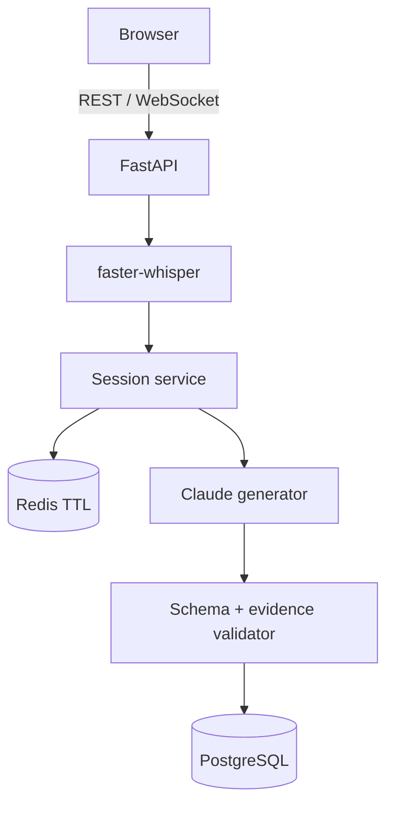
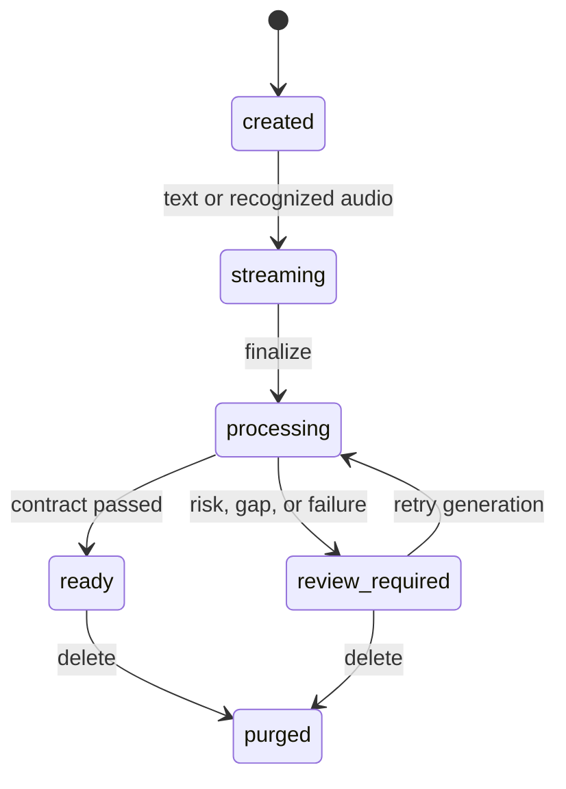

# Architecture

## 제품 경계

CareFlow는 합성 상담 대화로 검증하는 독립 포트폴리오입니다. 마이크 음성을 텍스트로 바꾸고, 대화에 명시된 사실만 S/O/P 초안으로 정리합니다. 환자를 진단하거나 위험도를 판정하거나 치료를 추천하지 않습니다.

## 구성요소

- **브라우저**는 합성 텍스트 또는 한 발화의 완성된 오디오를 전송합니다.
- **FastAPI**는 HTTP/WebSocket 입력 계약, 크기 제한, request ID, health와 metrics를 담당합니다.
- **faster-whisper**는 오디오를 자동 삭제 임시 파일에서 디코딩하고 CPU thread에서 전사합니다.
- **Session service**는 상태 전이, 순번 중복, TTL, 생성 실패 재시도를 소유합니다.
- **Redis**는 전사된 원문만 TTL로 보관합니다. 원본 오디오는 저장하지 않습니다.
- **Claude generator**는 Anthropic Messages API에 S/O/P 전용 JSON Schema를 전달합니다.
- **Validator**는 Pydantic 추가 필드 금지, 근거 순번 존재 여부, 근거 공백과 안전 토큰을 검사합니다.
- **PostgreSQL**은 세션 메타데이터, S/O/P 초안, 근거 순번, 원문 없는 감사 이벤트를 저장합니다.

## 상태 머신

`processing`, `ready`, `review_required`, `purged` 상태에서는 새 발화를 거부합니다. 단, `generation_failure`이고 TTL 원문이 남아 있으면 같은 finalize 요청으로 생성을 재시도합니다.

## 오디오 프로토콜

1. 클라이언트가 `audio.start` JSON으로 순번·화자·MIME을 선언합니다.
2. 서버가 `audio.ready`를 반환합니다.
3. 클라이언트가 완성된 오디오를 WebSocket binary frame 하나로 전송합니다.
4. 서버가 최대 10MB와 전사 후 최대 45초를 확인합니다.
5. Whisper 전사 결과를 기존 `append_chunk` 경로에 넣습니다.
6. 서버가 `transcript.recognized`와 `raw_audio_persisted=false`를 반환합니다.

오디오가 여러 프레임으로 계속 들어오는 연속 스트리밍 ASR은 현재 범위가 아닙니다.

## Claude 출력 계약

Claude는 `subjective`, `objective`, `plan`, `evidence` 네 필드만 생성할 수 있습니다. `assessment`를 포함한 추가 필드는 Anthropic 구조화 출력 스키마와 Pydantic `extra="forbid"`에서 차단합니다. `plan`은 의료진이 대화에서 명시한 후속 계획만 요약하며 모델이 새 치료나 검사를 제안하지 않도록 시스템 규칙을 둡니다.

## 실패 의미론

| 실패 | 시스템 동작 | 원문 |
| --- | --- | --- |
| 오디오 형식·크기 오류 | 전사 전 거부 | 음성 비저장 |
| Whisper 디코딩·무음 실패 | 일반화된 오류 반환 | 음성 비저장 |
| 중복 sequence | 기존 발화를 유지하고 duplicate 응답 | TTL 갱신 |
| sequence 공백 | 초안 생성 후 사람 검토 | 삭제 |
| 안전 토큰 | 임상 판정 없이 사람 검토 | 삭제 |
| S/O/P 근거 부족 | 사람 검토 | 삭제 |
| Claude HTTP·거절·토큰·스키마 실패 | 실패 초안, 사람 검토, 재시도 허용 | TTL 동안 유지 |
| 명시적 delete | 전사·초안 삭제 | 삭제 |

## 배포 경계

Docker Compose는 PostgreSQL 16, Redis 7, API와 Alembic migration을 연결합니다. Terraform은 ECS·ALB·RDS·ElastiCache의 구조적 시작점입니다. 실제 AWS 계정에는 적용하지 않았고, 인증·비밀관리·암호화 키·WAF·백업복구 검증은 후속 과제입니다.

